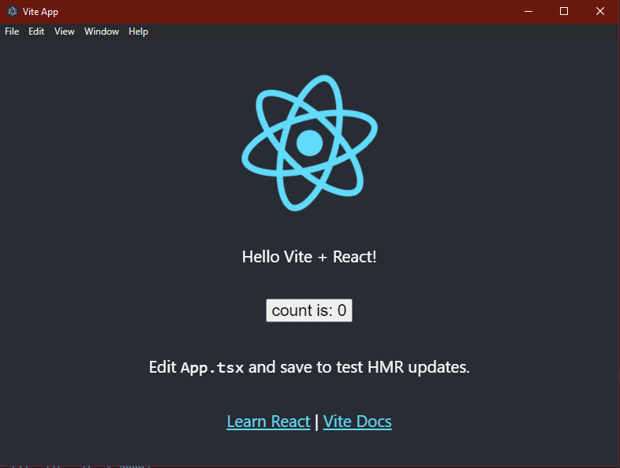

# Vite + React + Typescript + Electron - Starter

> It is a simple starter tempalte without unnecessary packages.

This Starter utilizes [Vite](https://github.com/vitejs/vite), [React](https://reactjs.org/), [Typescript](https://www.typescriptlang.org/) and [Electron](https://electronjs.org/).

By default, the React framework is used for the interface, but you can easily use any other frameworks such as Vue, Preact, Angular, Svelte or anything else.

> Vite is framework agnostic

## Installation
Clone this repo and install all dependencies  
`yarn` or `npm install`

## Development

`yarn dev` or `npm run dev`

## Build

`yarn build` or `npm run build`

## Publish

`yarn dist` or `npm run dist`
